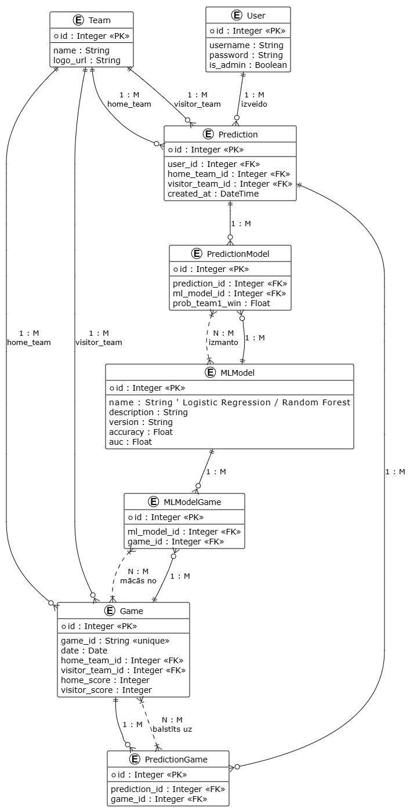

# 🧠 Proj_lab_darbs
Mācību kursa *"Projektēšanas laboratorija (1), 25/26-R"* repozitorija izveide.

---

## 🔍 Līdzīgo risinājumu pārskats

### 🏀 Rithmm — AI NBA izvēles un personalizēti modeļi
**Ko dara:** piedāvā AI ģenerētas izvēles NBA (un citos sportos) ar uzvaras varbūtībām, gaidāmo iznākumu un tirgus koeficientiem.  
**Kā strādā:** AI modeļi apmācīti uz vairāku gadu NBA datiem, simulējot spēles tūkstošiem reižu, iekļaujot spēlētāju statistiku, traumas un vēsturisko sniegumu.  
**Ko saņem lietotājs:** dienas labākos AI pickus ar uzvaras procentu, gaidāmo rezultātu un paskaidrojumu, kāpēc izvēle ir vērtīga.

---

### ⚙️ Dimers — simulāciju dzinējs pret tirgu
**Ko dara:** rāda uzvaras varbūtības katrai spēlei un atrod tirgus neatbilstības (“value bets”).  
**Kā strādā:** DimersBOT veic vairāk nekā 10 000 simulāciju uz katru notikumu un salīdzina ar profesionālu analītiķu datiem.  
**Ko saņem lietotājs:** spēļu lapas ar varbūtībām, “best bets”, koeficientu salīdzinājumiem, trendiem un projekcijām.

---

### 📊 Wise Prediction — AI “dashboard” ar vairākām līgām
**Ko dara:** uztur basketbola prognožu paneli ar ikdienas AI prognozēm dažādām līgām.  
**Kā strādā:** izmanto mašīnmācīšanās modeļus, kas analizē vēsturiskos un aktuālos datus, lai prognozētu spēļu iznākumus.  
**Ko saņem lietotājs:** centralizētu paneli ar šodienas spēlēm un prognozētajiem rezultātiem.

---

### 🤖 Leans.AI — “REMI” AI picks ar pārliecības vienībām
**Ko dara:** publicē AI ģenerētus variantus vairākām sporta līgām (NBA, CBB u.c.) ar “unit confidence” reitingu.  
**Kā strādā:** REMI modelis apkopo miljonus datu punktu, veic statistiskus aprēķinus un dinamiski atjaunojas.  
**Ko saņem lietotājs:** bezmaksas dienas izvēles, bet abonementā – plašāku prognožu un statistikas klāstu.

---

### 📈 ATS Wins — tūkstošu simulāciju pieeja vairākām līgām
**Ko dara:** AI vadīta prognožu platforma, kas nodrošina projekcijas, props, publisko likmju sadalījumu un ikdienas picks.  
**Kā strādā:** katru dienu veic tūkstošiem simulāciju, apvienojot AI algoritmus ar ekspertu ieskatu.  
**Ko saņem lietotājs:** spēļu un spēlētāju prognozes vienuviet, ar viegli uztveramu interfeisu.

---

## 🧩 Kopsavilkums
Lielākā daļa līdzīgo risinājumu izmanto mākslīgā intelekta vai algoritmisku modelēšanu, kas balstīta vēsturiskajos datos.  
Tie prognozē spēļu rezultātus, uzvaras varbūtības un sniedz papildstatistiku.

**Kopīgas iezīmes:**
- Ierobežota bezmaksas piekļuve, vairumā gadījumu nepieciešams abonements.  
- Vizualizācijas bieži ir tabulu vai teksta formā, nevis interaktīvi grafi.  
- Datu ievākšana un modeļu trenēšana notiek sezonas sākumā.  
- Risinājumi fokusējas uz vairākām līgām, ne tikai NBA.

---

## 🧩 Konceptu modelis

*Attēls: Projekta konceptuālais modelis, kas ataino datu plūsmu starp lietotāju, AI modeli un vizualizācijas komponentēm.*

---

## ⚙️ Tehnoloģiju steks

| Komponents | Tehnoloģija |
|-------------|--------------|
| **Serveris** | Azure |
| **Operētājsistēma** | Linux (Debian vai Ubuntu) |
| **Web serveris** | Apache vai Nginx |
| **Backend** | Python Flask |
| **Datubāze** | SQLAlchemy |
| **Frontend** | HTML, CSS, JavaScript |
| **Datu vizualizācija** | Chart.js |

---

## 🚀 Par projektu
Šī repozitorija mērķis ir izstrādāt **AI basketbola prognožu platformas prototipu**, kas apvieno datu modelēšanu un vizualizāciju vienā vidē.  
Tiks radīts risinājums, kas ļauj lietotājam:
- Aplūkot prognozes grafiskā formā (Chart.js).  
- Analizēt spēļu vēsturiskos un aktuālos datus.  
- Pārbaudīt un salīdzināt AI ģenerētās prognozes ar reāliem rezultātiem.

---
